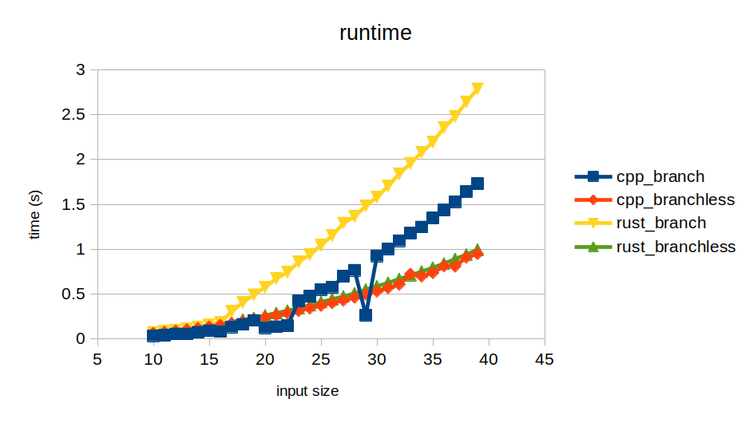

# Branchless Programming Demo
This repo contains a simple demo in c++ and rust for branchless programming technique and its effect experimented on linux-x64 platform.

## Program
A simple program is to take in two vectors `xs` and `ys` of optional int64 values: the value may be missing and is therefore `null`. Then it is to calculate the sum of products of every pair `x,y` in `xs,ys`, such that if any of the values are missing in the pair, 1 will be subtracted from the sum.

## Benchmark Result




## Run it yourself
```sh
$ cargo build -r
$ make -j
$ bash run_benchmark.sh
# then print the table
$ paste instructions*.txt
$ paste branches*.txt
$ paste branch_miss*.txt
$ paste time_*.txt
```